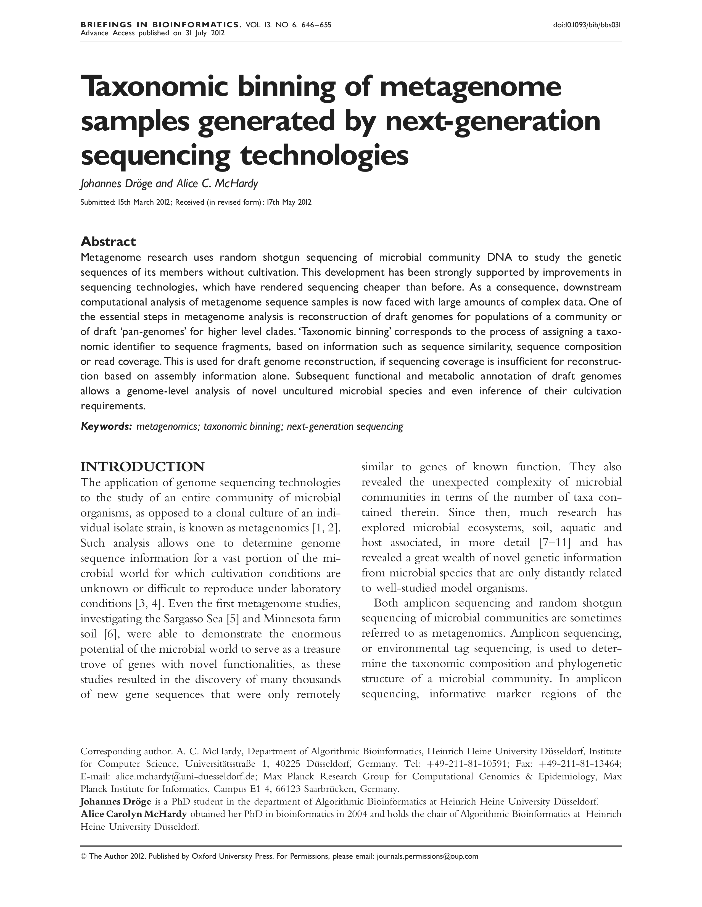

### Taxonomic Binning of Metagenome Samples {#sec:publication_bib}

{#fig:publication_bib_preview}

|  |  |
| :---------- | ------------------------------------------------------------ |
| **Title** |  Taxonomic binning of metagenome samples generated by next-generation sequencing technologies |
| **Journal** |  Briefings in Bioinformatics |
| **Published** | 31 July 2012 |
| **Authors** | Johannes Dröge, Alice C. McHardy |
| **DOI** | [10.1093/bib/bbs031](https://doi.org/10.1093/bib/bbs031) |

#### Description

This is a review article as an introduction to metagenome binning which summarizes algorithmic approaches in the year 2012. We present and categorize the existing binning techniques, provide guidelines to choose a particular method and give usage examples. At last, we describe current and future trends related to metagenome binning.

#### Full Abstract

Metagenome research uses random shotgun sequencing of microbial community DNA to study the genetic sequences of its members without cultivation. This development has been strongly supported by improvements in sequencing technologies, which have rendered sequencing cheaper than before. As a consequence, downstream computational analysis of metagenome sequence samples is now faced with large amounts of complex data. One of the essential steps in metagenome analysis is the reconstruction of draft genomes for populations of a community or of draft ‘pan-genomes’ for higher level clades. ‘Taxonomic binning’ corresponds to the process of assigning a taxonomic identifier to sequence fragments, based on information such as sequence similarity, sequence composition or read coverage. This is used for draft genome reconstruction, if sequencing coverage is insufficient for reconstruction based on assembly information alone. Subsequent functional and metabolic annotation of draft genomes allows a genome-level analysis of novel uncultured microbial species and even inference of their cultivation requirements.

#### Article Short Version

##### Introduction

Genome sequencing applied to an entire microbial community, as opposed to a clonal culture, is known as metagenomics. It allows to access the genomes of many genomes for which cultivation conditions are unknown oder difficult to reproduce. Some early metagenome studies retrieved thousands of new gene sequences and an unexpected diversity of taxa which was followed by explorations of soil, aquatic and host-associated environments. Many enviromental species which they discoverd were only distantly related to organisms previously known. The term metagenomics can refer to both amplicon sequencing or random shutgun sequencing. The former studies only informative marker regions, for instance within the ribosomal genes, which are amplified using polymerase chain reaction (PCR) and sequenced to determine the number and abundance of different taxa. Such abundance profiles can be correlated across communities and associated with environmental parameters but the actual gene inventory remains largely unknown. In contrast, shutgun sequencing targets random parts of the genomes to that this approach can reconstruct draft genome sequences for individual community members, which allows to study taxa on the level of genes and their associated functions.

##### Next-generation Sequencing Technologies

Over the last years, rapid advances in next-generation DNA sequencing (NGS) have shaped metagenomic research. The new technologies allow for quicker and cheaper sequencing through massive parallelization but also lead to shorter sequencing reads compared to Sanger sequencing ($\sim$ 800 bp): SOLiD ($\sim$ 50-75 bp), Illumina (5-150 bp), IonTorrent (100-200 bp) and 454 (550-1000 bp). Upcoming single-molecule sequencing promises longer reads: PacBio (> 1kb) and Oxford Nanopore (5-10 kb). However, all platforms come with different sequencing error profiles due to specific preparation and detection procedures so that the choice must depend on the scientific questions asked. For instance, genome assembly requires substantially longer or paired reads and higher sequencing depth than a diversity estimate using amplicon sequencing.

##### Bioinformatic Analysis of Metagenome Samples

Currently, a single Illumina HiSeq run generates up to 600 Gb, approximately 10^4^ times more than Sanger sequencing in the same time frame. Such large volumes cause drastically increased runtimes for algorithms involved in metagenome processing, for instance assembly, genome binning, gene prediction and functional annotation. Metagenome assembly aligns individual reads, based on overlapping reads and pairing information, to construct longer contiguous sequences called contigs. While this is a standard procedure for clonal genome sequencing, it is much more challenging for metagenomes because many different and potentially closely related organisms exist with variable abundances. Binning then sorts the assembled contigs into bins corresponding to species populations or higher-level clades. Therefore, assembly and binning together yield reconstructed draft genomes which can be further analyzed using gene prediction, functional annoation and reconstruction of potential pathways. Dedicated web applications exist to facilitate the analysis of metagenomes.

##### Binning Strategies

Different types of information can be used to bin metagenome sequences, which are: (a) local sequence similarity, (b) nucleotide sequence composition and (c) read coverage and linkage information from assembly. The assignment accuracy of taxonomic binning depends on several factors. For instance, contigs shorter than 1 kb are too noisy to be assigned accurately in most cases. The number of taxa in a community also plays an important role, for instance high-complexity soil metagenome assemblies yield shorter contigs due to insufficient sequencing depth. Finally, the availability of reference genome sequences from closely related taxa is important for accurate binning with reference-based assignment. If no reference data is available, a sequence clustering approach can be used for binning.

Similarity-based taxonomic assignment utilizes the local similarity of a query sequence to sequences of known taxa. After determination of reference candidates, for instance using local alignment, the predicted taxon is usually calculated using algorithms such as finding the lowest common ancestor (LCA) in a reference taxonomy or phylogenetic placement, which uses a reference phylogenetic tree instead of the taxonomy. The initial search for homologs is a disadvantage of this approach as it is time-consuming and involves a large sequence collections such as the NCBI RefSeq. The search is less demanding, but also less sensitive, if pre-built hidden Markov models (HMMs) are used.

Nucleotide sequence composition such as GC-content, condon usage or short oligomers with a typical length of 4 to 6 bases ($k$-mers) tend to be stable within species genomes and higher level taxa. Unsupervised methods such as self organizing maps (SOMs) can use this information to derive genome bins, which can be annotated taxonomically afterwards. Supervised methods such as support vector (SVMs) first train a classifcation model using the nucleotide composition of reference genomes and then assign each contig. The latter tend to have higher accuracy and are more easily applied to complex microbial mixtures with skewed organismal abundances but require a sufficient amount ($\sim$ 100 kb) of suitable sequence data for training. Therefore, both clustering and classification methods are being applied in practice.

Hybrid methods combine different types of information, for instance $k$-mers with read coverage. Often, linkage information from assembly is also used to improve or verify genome bins. Hybrid methods are especially beneficial for contigs shorter than 1 kb.

##### Advantages and Disadvantages of Different Binning Approaches

Multiple factors such as the number and abundances of taxa, their phylogenetic structure, availability of reference genome sequences and computing resources have an impact on binning performance. Similarity-based methods can assign individual reads of less than 1 kb at the species level only if a corresponding reference genome sequence exists. However, this is not usually the case and read assignment is notably less accurate than contig assignment. Also, the run-time complexity for the sequence similarity searches is determined by a product of the query (the contigs) and the reference sequence lengths. Since this is computationally demanding for large NGS datasets, researchers can submit their data to external web-based services. Using sequence composition, classification methods are also likely more accurate than clustering if reference data is available, but otherwise clustering allows to resolve taxonomic bins which would go undetected. In contrast to similarity-based assigment, classification by sequence composition requires less data and time in the training step compared to similarity searches and once a model has been trained, the runtime for sequence classification scales linearly with the sample size. Composition-based clustering requires no training but scales at least quadratically, usually involving pairwise comparisons.

##### Future Directions

Sequencing and algorithmic improvents allowed to retrieve near-complete draft genomes from metagenomes including complex communities such as soil. However, challenges which remain to be addressed include the reduction of the computational requirements to search for similarities in large samples and reference collections and the improvement of the assignment of the vast majority of taxa which are only distantly related to sequenced isolate genomes. Strategic sequencing of taxa supported by single-cell genome sequencing can lead to a better reference coverage in the future. Also, single-molecule sequencing will eliminate many problems in metagenome processing, which are associated with the short read length, but denoising procedures need to be developed for the new technologies. Finally, the algorithms in metagenome processing need to be adjusted to consider other content such as viruses.
