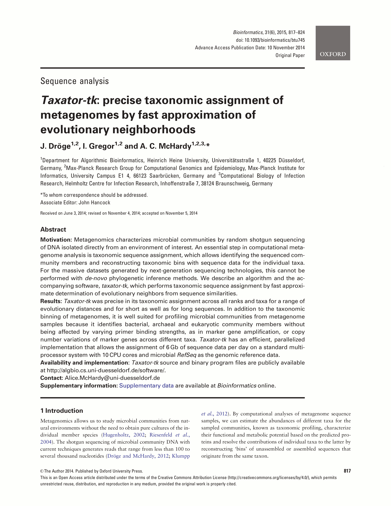

### Taxator-tk: Taxonomic Annotation of Metagenomes {#sec:publication_taxator-tk}

{#fig:publication_taxator-tk_preview}

|  |  |
| :---------- | ------------------------------------------------------------ |
| **Title** |  Taxator-tk: Precise Taxonomic Assignment of Metagenomes by Fast Approximation of Evolutionary Neighborhoods |
| **Journal** |  Bioinformatics |
| **Published** | 10 November 2014 |
| **Authors** | Johannes Dröge, Ivan Gregor, Alice C. McHardy |
| **DOI** | [10.1093/bioinformatics/btu745](https://doi.org/10.1093/bioinformatics/btu745) |

#### Description

This method article describes a high-performance tool for taxonomic annotation of metagenomes using phylogenetic principles. The procedure splits the input sequences (contigs) into smaller separate homology regions (segments) to which it applies a newly developed realignment placement algorithm (RPA) for taxonomic classification of these regions. This algorithm calculates pairwise alignment scores to estimate the phylognetic distances and simultaneously approximates a corresponding phylogenetic tree structure. The alignments are non-exhaustive and are stopped once a good taxon estimate has been determined or if no phylogenetic signal can be found in the input. In a final merging step, the subregion predictions are combined for the full sequence to minimize the error of the predicted taxon. The program is implemented in C++ and applies parallel computations.

#### Full Abstract

##### Motivation

Metagenomics characterizes microbial communities by random shotgun sequencing of DNA isolated directly from an environment of interest. An essential step in computational metagenome analysis is taxonomic sequence assignment, which allows identifying the sequenced community members and reconstructing taxonomic bins with sequence data for the individual taxa. For the massive datasets generated by next-generation sequencing technologies, this cannot be performed with de-novo phylogenetic inference methods. We describe an algorithm and the accompanying software, taxator-tk, which performs taxonomic sequence assignment by fast approximate determination of evolutionary neighbors from sequence similarities.

##### Results

Taxator-tk was precise in its taxonomic assignment across all ranks and taxa for a range of evolutionary distances and for short as well as for long sequences. In addition to the taxonomic binning of metagenomes, it is well suited for profiling microbial communities from metagenome samples because it identifies bacterial, archaeal and eukaryotic community members without being affected by varying primer binding strengths, as in marker gene amplification, or copy number variations of marker genes across different taxa. Taxator-tk has an efficient, parallelized implementation that allows the assignment of 6 Gb of sequence data per day on a standard multiprocessor system with 10 CPU cores and microbial RefSeq as the genomic reference data.

#### Article Short Version

##### Introduction

In metagenomics, we study microbial communities from natural environments without obtaining species cultures. Using sequencing followed by computational analyses, we can estimate the abundances of taxa, known as taxonomic profiling, and characterize their metabolic potentials by sorting nucleotide sequences into genome bins (binning) and predicting proteins therein. Taxonomic profiling is conceptually different from taxonomic binning because it only requires (partial) genes, which are taxonomically informative, and which can be obtained using amplicon sequencing whereas binning needs to deal with all parts of a genome. Universal marker genes used for profiling are usually classified by phylogenetic placement, which considers a gene reference tree of the corresponding gene as a proxy for the species phylogeny. Random genome regions, as obtained by shotgun sequencing, typically lack such reference trees. Therefore, a taxonomy is used instead and query sequences are compared to reference genomes, which are annotated with corresponding taxa. Such comparison can be done based on direct sequence matching or based on nucleotide sequence composition, for instance $k$-mers, which also allows draft genome recovery from deep-branching lineages. However, sequence matching by alignment is more accurate, in particular for sequences shorter than 1 kb. These algorithms use alignment scores and threshold parameters to quickly determine an evolutionary neighborhood of a query but lack a well-motivated evolutionary framework. Calculating de-novo gene trees for every query in the metagenome is computationally too demanding for large metagenome samples. Our software *taxator-tk* extends the traditional score-based approach by approximating phylogenetic gene trees using a linear number of pairwise alignments and thereby provides more accurate taxonomic assignments without requiring conservation threshold parameters.

##### Methods

The workflow for the taxonomic assignment of a query sequence consists of three parts ([@fig:taxatortk_workflow]): (a) a local alignment search for homologs, (b) the core assignment algorithm and (c) a post-processing step to merge subregion annotations. The initial search can be run by different aligners and using different reference sequence collections. Based on the resulting local alignments, each query sequence is split into distinct subregions (segments), omitting parts which have no similarity to any reference. This step reduces the overall number of positions for further alignments and accounts for genome arrangements. Each segment along with its homologous reference sequences is processed by the core algorithm to predict a taxon. The final merging step considers all segment predictions of a query sequence and determines the final taxon for assignment.

{#fig:taxatortk_workflow}

The core realignment placement algorithm (RPA) ([@fig:taxatortk_rpa]) assigns a taxon Q to a query segment *q* using a limited number of pairwise alignments among *q* and its homologous segments obtained by local alignment to reference sequences. It aims to identify a set of segments which form a monophyletic group or subtree in the corresponding phylogeny. First, the most similar segment *s* is aligned to the query *q* and all other segments in the set (pass 1). An outgroup segment *o* is determined as the first sequence with distance larger than $distance(s,q)$. The taxa of all segments with distance smaller or equal to $distance(s,o)$ are added to the neighborhood set M. Then, all segments are aligned to the outgroup segment *o* (pass 2), again adding taxa with distances smaller than $distance(o,q)$ to M. We assign the least common ancestor (LCA) of all taxa in M to segment *q*. The segments in M form a subtree among all available segment taxa. Sometimes, if no outgroup can be found or if the taxa in M are very diverse, the algorithm terminates and the predicted taxon is the taxonomy root, meaning unassigned. The RPA requires approximately $2n$ alignments, where $n$ is the number of reference segments.

{#fig:taxatortk_rpa}

##### Results

We evaluated the performance of taxonomic assignment with taxator-tk for different datasets: (a) 7176 16S rRNA genes, (b) simulated short sequences of length 100, 500 and 1000 bp, (c) simulated contigs for a synthetic microbial community and two public benchmark datasets and (d) contigs of a microbial community from cow rumen. When possible, we applied cross-validation and evaluated different taxonomic distances between sample and reference taxa. In all cases, the reference data were a diverse collection of full and partial genome sequences with taxonomic annotation. As expected, performance for 16S marker genes was best because it contained a clear phylogenetic signal. In practice, such sequences are best classified using phylogenetic placement because it makes use of reference phylogenies. The second evaluation with nucleotide sequences resembling individual reads, which were sampled from 1729 different species, showed that precision was high even for short sequences, but about 10 % lower on average than for 16S data. The recall increased with the length of the sequences. Therefore, it is recommended to assemble reads prior to assignment with taxator-tk. For the validation with assembled contigs, we compared our results to other state-of-the-art assignment methods: CARMA, MEGAN, Kraken (all similarity-based) and PhyloPythiaS (composition-based). For the newly simulated community consisting of 49 different species and the two benchmark datasets, taxator-tk assigned substantially fewer contigs falsely at species and genus levels, resulting in a much better precision but with a reduced recall. PhyloPythiaS, a classifier based on nucleotide composition ($k$-mers), had the best recall in a specific usage scenario. For the 319 Mb cow rumen dataset, taxator-tk was most consistent in assigning 2 kb sub-sequences to taxonomic bins, which confirmed the previous results on simulated contigs. In summary, taxtor-tk also predicted the most realistic number of taxa in the samples compared to the other programs. Concerning runtime, it was slower than Kraken and MEGAN, due to additional computations, but faster than CARMA due to the efficient and parallel implementation: we processed $\sim$ 6 Gb per day using 10 CPU cores, including the initial local alignment step. The segmentation procedure of taxator-tk accounted for a 30 % decrease of the overall runtime and the program scaled approximately linearly with the input data size.

##### Discussion

Throughout all validation experiments, we could show that taxator-tk was the most precise method in assigning metagenome nucleotide sequences to corresponding taxa, which also resulted in the most realistic number of taxa. However, it assigned fewer data overall than other methods. This trade-off is a direct implication of the algorithm design, which is tailored towards minimization of errors. Therefore, it can confidently assign a core of sequences, for instance to train a model using nucleotide composition or to estimate taxon abundances. Unstructured reference data allow to assign across all domains of life, in contrast to most methods using specific marker genes. From a methodological point of view, we presented an alternative phylogenetic inference algorithm which runs in linear instead of log-linear time with respect to the number of homologs, and which applies to any nucleotide fragment without requiring pre-set or user-defined parameters. Besides metagenome assignment, it can be used for any DNA or RNA sequence annotation, for instance to detect contamination in isolate sequencing data.
