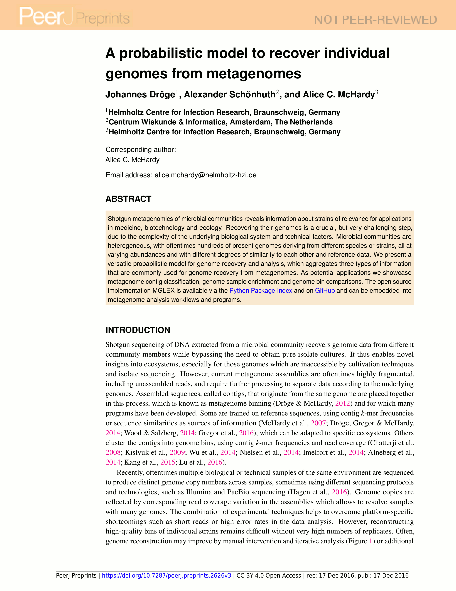

### A Probabilistic Model for Genome Recovery {#sec:publication_mglex}

{#fig:publication_mglex_preview}

|  |  |
| :---------- | ------------------------------------------------------------ |
| **Title** |  A Probabilistic Model to Recover Genomes in Shotgun Metagenomics |
| **Journal** |  PeerJ |
| **Published** | 2016 (preprint), 2017 (under revision) |
| **Authors** | Johannes Dröge, Alexander Schönhuth, Alice C. McHardy |
| **DOI** | [10.7287/peerj.preprints.2626](https://doi.org/10.7287/peerj.preprints.2626)

#### Description

This method article describes a probabilistic model for use in metagenome binning. Such likelihood models are at the core of many popular algorithms, including sequence classification and clustering. While some models existed as part of metagenome contig clustering programs, we developed a modular, stand-alone and reusable model using additional input features. This model is based on a set of parametrized submodels for which maximum likelihood (ML) parameter estimates can be infered. Besides classification and clustering, we demonstrate alternative applications such as sample size reduction and visualization. The method is provided as an open source Python library and command line programm.

#### Full Abstract

Shotgun metagenomics of microbial communities reveals information about strains of relevance for applications in medicine, biotechnology and ecology. Recovering their genomes is a crucial, but very challenging step, due to the complexity of the underlying biological system and technical factors. Microbial communities are heterogeneous, with oftentimes hundreds of present genomes deriving from different species or strains, all at varying abundances and with different degrees of similarity to each other and reference data. We present a versatile probabilistic model for genome recovery and analysis, which aggregates three types of information that are commonly used for genome recovery from metagenomes. As potential applications we showcase metagenome contig classification, genome sample enrichment and genome bin comparisons. The open source implementation *MGLEX* is available via the [Python Package Index](https://pypi.python.org/pypi/mglex/) and on [GitHub](https://github.com/hzi-bifo/mglex/) and can be embedded into metagenome analysis workflows and programs.

#### Article Short Version

##### Introduction

Shotgun sequencing of a microbial community bypasses the need to obtain pure cultures and thus enables novel insights into ecosystems, in particular for those genomes that are inaccessible by cultivation. Since current metagenome assemblies are oftentimes highly fragmented, a process called binning sorts assembled sequences (contigs) according to the underlying genomes. Various programs were written to bin metagenomes, using different methodologies and sequence features. These comprise classification and clustering by consideration of nucleotide composition ($k$-mer distributions), sequence similarity and assembly read coverage. Coverage information can be very powerful if multiple samples with varying genome copies are sequenced and co-assembled. However, with a limited number of samples, it remains difficult to reconstuct high-quality bins down to the strain level. Here, we propose a model for metagenome binning, using probabilities to represent natural uncertainty. The model aggregates explicit submodels for read coverage, nucleotide composition and contig similarity to reference sequencing (via taxonomic annotation). This design incorporates knowledge about the feature generation process in each submodel, which leads to a robust fit when few data are available. In contrast, other methods frequently apply a data-driven transform before clustering with a single, e.g. Gaussian, model. Our implementation *MGLEX* does not represent an automatic binning solution but is a flexible framework to target binning problems.

##### Methods

A classification model is trained to distinguish data of different classes. In probabilistic modeling, training means to determine the model parameters ($\theta$) from example data for a set of different classes. Here, classes correspond to different genomes which make part of a metagenome and the data to be classified are contigs. Hence, we need to provide training sequences for each genome before we can classify unknown contigs.

Let $1\le i\le N$ be an index referring to $N$ contigs resulting from a shotgun metagenomic experiment. For the $i$^th^ contig, we define a joint likelihood ([@eq:mglex_likelihood_aggregate]), which is a weighted product over $M$ independent submodels likelihoods for the different feature types. For the $k$^th^ submodel, $\bm{\mathit{\Theta_k}}$ is the corresponding parameter vector, $\bm{F_{i,k}}$ the feature vector of the $i$^th^ contig and $\alpha_k$ defines the contribution of the respective submodel or feature type. $\beta$ is a free scaling parameter to adjust the smoothness of the aggregate likelihood distribution over the genome bins (bin posterior).

$$
\mathcal{L}(\mathbf{\Theta} \mid \mathbf{F_i})
= \left( \prod_{k=1}^M \mathcal{L}(\bm{\mathit{\Theta_k}} \mid \bm{F_{i,k}})^{\alpha_k} \right)^\beta
$$ {#eq:mglex_likelihood_aggregate}

The model assumes statistical independence of the submodel features. All model parameters are determined from training data, $\mathbf{\Theta}$ using submodel ML estimation, $\bm \alpha$ using the inverse standard deviations of the class log-likelihood distributions ([@fig:mglex_alpha_inference]) and $\beta$ by mean squared error (MSE) minimization ([@fig:mglex_beta_fitting]).

{#fig:mglex_alpha_inference}

{#fig:mglex_beta_fitting}

We integrate different submodels $\mathcal{L}(\bm{\mathit{\Theta_k}} \mid \bm{F_{i,k}})$ according to distinct input feature types:

* a Poisson model for absolute read coverage considering multiple samples
* a Binomial model for relative read coverage considering multiple samples
* a Naïve Bayes model for $k$-mers
* a set of layered Naïve Bayes model for taxonomic annotation of contigs

The last model is an adjustment of the standard Naïve Bayes model for hierarchical labels because the a taxonomy represents a tree-like class structure ([@fig:mglex_hnbayes_tree]). All submodels are kept simple and make independence assumptions to simplify calculations.

{#fig:mglex_hnbayes_tree}

We simulated a metagenome (400 genomes with strain heterogeneity) and created short contigs (1 kb) to validate and demonstrate the aggregate model. Differential abundances were produced by simulating Illumina reads (150 bp) for a primary lognormal and three secondary abundance distributions and by mapping the resulting reads to the contigs, introducing typical biases but omitting actual read assembly. For each genome, we obtained 300 kb of contig data and calculated read coverage, $5$-mer frequencies and taxonomic annotation.

##### Results

Using the simulated metagenome, we applied three-fold cross-validation and checked how well the model classified contigs to the most likely genome (ML) with different combinations of input features. Genome abundance turned out to be the weakest single feature type while taxonomic annotation from local alignment to reference genome sequences was the strongest. However, the aggregation of submodels according to [@eq:mglex_likelihood_aggregate] yielded better performance in all cases. In summary, about 68% of contigs pairs, which were not used for model training, were classified to the same genome using all available submodels. Considering species-level bins, this value increased to 88%, which showed that the model had difficulties to distinguish strains of the same species using the differential abundance values stemming from only four samples in our simulation. The error decreased further when applying soft (not ML) classification by fitting the parameter $\beta$ ([@fig:mglex_beta_fitting] because each contig could be assigned to multiple classes with varying class posterior probability (attribution weight).

We demonstrate alternative model applications besides classification. Using the likelihood distributions in the training data, we calculate p-values which indicates how extreme a particular contig likelihood is with respect to the training data. With sufficient training data (100 kb in our example), we use the p-value to enrich a metagenome sample *in-silico* for a specific genome so that irrelevant contigs are removed and the overall sample size is reduced. On average, a critical p-value of 2.5% led to a sample size reduction of 95%. Such shrinkage is useful for a more focused analysis or to apply a method with otherwise prohibitive runtime. As a second application example, we derived a probabilistic measure to quantify the similarity between any two genomes or genome bins. The quantity is based on a relative mixture likelihood and may be used to cluster bins hierarchically and to analyze the similarity structure of genome bins (@fig:mglex_tree_bin_comparison). In particular, the method indicates whether the resolution of individual bins is justified with respect to the model and contig data.

![Average linkage clustering of a random subset of 50 out of 400 genomes using probabilistic distances to analyze bin resolution. This example compares the left (blue) tree, which was constructed only with nucleotide composition and taxonomic annotations, with the right (red) tree, which uses all available features. The tip labels were shortened to fit into the figure. The similarity axis is scaled logarithmically to focus on values near one. Bins which are more than 50% similar branch in the outermost ring whereas highly dissimilar bins branch close to the center. ](figure/mglex_bincomparison.pdf){#fig:mglex_tree_bin_comparison}

*MGLEX* is a Python library using NumPy and includes a command line interface to the main functionality, such as model training, classification, p-value and error calculations.

##### Discussion

We describe an aggregate likelihood model with possible applications in metagenome binning, for instance classification, genome enrichment and visualization. It builds on specific submodels, each responsible for different feature types. The modular design helps to improve the model and to compute and interpret the results. In comparison to previous methods, we added two new submodels. The first is a binomial for relative differential read coverage over multiple samples to account for systematic read mapping biases and the second is a layered Naïve Bayes model for taxonomic annotation, which allows to consider external knowledge from reference sequences for sequence binning. We also propose a new weighting scheme to combine the information of several submodels. Although our reference implementation called *MGLEX* in its current state does not support parallel computations, that should be easily added later. As the runtime for all submodel ML parameter estimations and sequence classification is linear in the number of contigs, an embedding into clustering algorithms such as the Expectation Maximization (EM) or Markov Chain Monte Carlo (MCMC) algorithms should be feasible. We hope to further develop the open-source package *MGLEX* as a flexible framework for metagenome analysis and binning, to be integrated into programs and workflows.
